<div align="center">

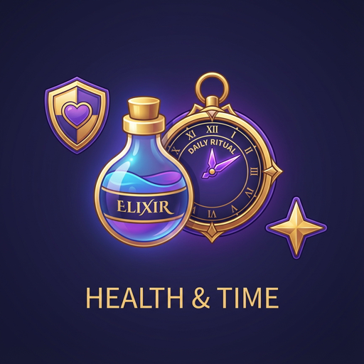

# Elixir: Daily Ritual

**Take your pills. Drink your water. Level up.**


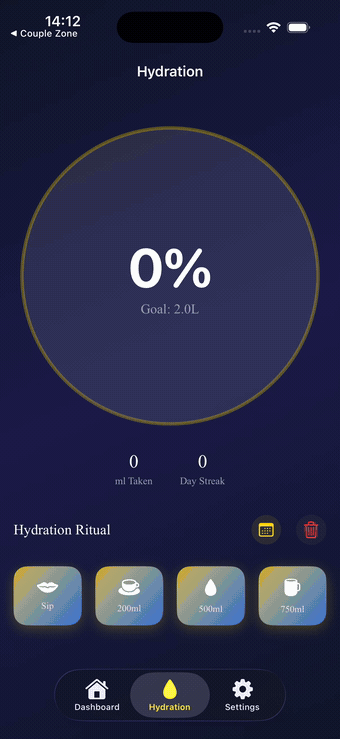

</div>

## What it does

A medication tracker and a water tracker, in one app, that treats both as the
same thing: a *ritual* you either kept today or didn't. Add what you take, when
you take it, how much water you're aiming for. The dashboard is one screen
telling you what's left.

Every dose you log is 30 XP. Every glass of water is 10, and closing out your
daily goal is another 50. Clear everything scheduled for a day — pills *and*
water — and that's a Perfect Day, worth 100 on its own.

The part that actually keeps you honest is the streak multiplier, because it
isn't a badge, it's arithmetic. Three days running puts every point you earn on
a 1.1× Bronze Flame. A week gets you Silver at 1.3×. Two weeks, Gold at 1.6×. A
month, and Diamond doubles everything you log. Miss a day and the multiplier
goes back to 1.0× with the whole ladder to climb again.

<div align="center">
<table>
<tr>
<td align="center" width="33%">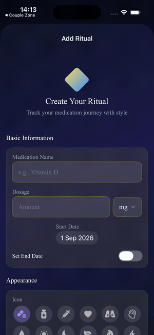<br><sub><b>Name it</b><br>Anything you take on a<br>schedule — pills, drops,<br>puffs, sprays.</sub></td>
<td align="center" width="33%">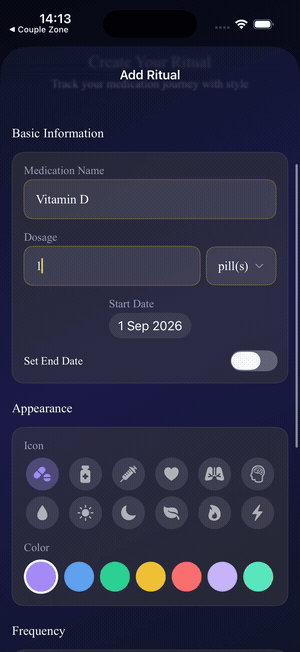<br><sub><b>Give it a face</b><br>An icon and a color, so<br>you recognize the row<br>without reading it.</sub></td>
<td align="center" width="33%">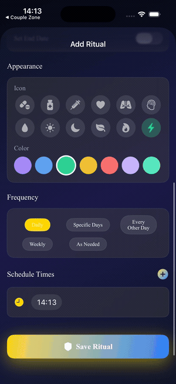<br><sub><b>Schedule it</b><br>Daily, twice, three or four<br>times, every other day,<br>weekly, specific days,<br>or only as needed.</sub></td>
</tr>
</table>
</div>

<table>
<tr>
<td width="34%" valign="middle">
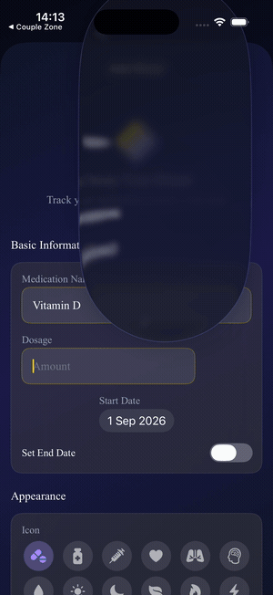
</td>
<td valign="middle">

Dosage isn't a free-text field pretending to be structured. It's a number and
one of thirteen units — `mg`, `g`, `mcg`, `ml`, `L`, `tbsp`, `tsp`, `drops`,
`pill(s)`, `IU`, `capsule(s)`, `spray(s)`, `puff(s)` — so *1 pill* and
*1000 IU* are both sayable without anyone inventing a format.

</td>
</tr>
</table>

## Why it's good

<table>
<tr>
<td width="42%" valign="top">
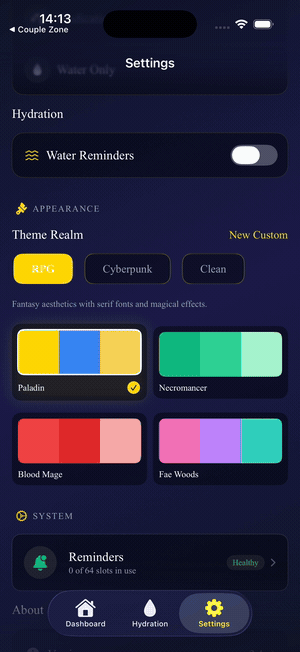
</td>
<td valign="top">

**A theme rewrites more than the colors.** There are eight, in three realms —
Paladin, Necromancer, Blood Mage and Fae Woods; Neon City and The Construct;
System and Lilac Dream — plus a builder for your own. Switching to Cyberpunk
sets the font to Courier, turns the "taken" checkmark into a CPU glyph, and
renames your rank from *Initiate* to *Script Kid*. It even rewrites your
reminders: the RPG realm tells you it's time to consume your potion, Cyberpunk
tells you your biometric levels are low and to inject immediately.

**Progress doesn't become impossible.** Levels 2 through 10 cost 150 XP each,
which is a fast first week. Level 11 onward costs a flat 1,500 XP, forever —
no exponent, no wall you hit in month three. Each realm has its own ten-rank
ladder to climb, ending at *Legendary Ritualist*, *The Singularity* or plain
*Legend* depending on where you live.

</td>
</tr>
<tr>
<td valign="top">

**Your reminders don't quietly die.** iOS lets an app hold 64 pending local
notifications and silently discards anything past that, which is how a
reminder app goes mute after two weeks without anyone noticing. Elixir
budgets them — up to 40
for medication, 10 for water, 2 held back for a failsafe — and an
every-other-day ritual books 7 occurrences covering two weeks instead of
burning 60 slots on a year of them. Four separate things top the queue back
up: every app launch, a daily background refresh, a weekly deep clean, and, if
all three have failed for days, a notification whose only job is to ask you to
tap it. There's a screen that shows you the count.

**Log a dose without opening anything.** *Taken* and *Skip* are buttons on the
notification itself.

</td>
<td width="42%" valign="top">
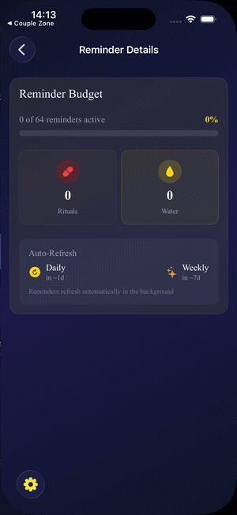
</td>
</tr>
</table>

**One widget, nine layouts.** Small, medium and large, each in medication mode,
water mode, or both — long-press to pick. The mascot is a potion bottle whose
face and fill level track the day: full and grinning when you're done, half
full and waiting when something's due, nearly empty and furious when you're
overdue. It's drawn entirely from SwiftUI shapes, so there isn't an image asset
in the widget bundle.

**Water only, pills only, or both.** Set the dashboard mode and the app commits
to it — Perfect Days and your consistency percentage are computed against
whichever halves you actually asked for, not against a goal you never set.

<div align="center">
<table>
<tr>
<td align="center" width="25%">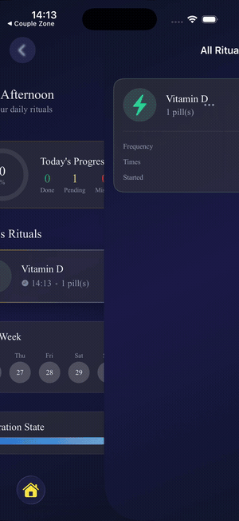<br><sub><b>The dashboard</b><br>Today's rituals, the<br>week behind you, and<br>how much water is left.</sub></td>
<td align="center" width="25%">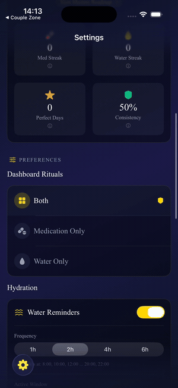<br><sub><b>Ritual Master</b><br>Rank, XP bar, both<br>streaks, Perfect Days.<br>Every number has a<br>tap-to-explain sheet.</sub></td>
<td align="center" width="25%">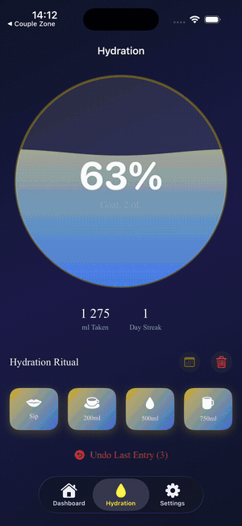<br><sub><b>Water history</b><br>A week of intake as a<br>chart, then every entry<br>of every day under it.</sub></td>
<td align="center" width="25%">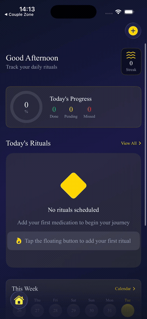<br><sub><b>All rituals</b><br>Everything you've set<br>up, with its frequency<br>and times. Swipe<br>to remove.</sub></td>
</tr>
</table>
</div>

## Questions

<details>
<summary><b>Will it tell me what to take, or warn me about interactions?</b></summary>
<br>

No, and it doesn't try. Elixir doesn't know what your medication *is* — the
name is a string you typed. It's a list, a clock and a scoreboard. Anything
about dosage or interactions is a conversation with a pharmacist, not an app.

</details>

<details>
<summary><b>What happens if I don't open the app for two weeks?</b></summary>
<br>

Your reminders keep firing. The queue is refilled by a daily background refresh
and a weekly deep clean that iOS runs while your phone is idle, and every
schedule is written to cover about two weeks ahead. If the system never gets
around to running either — it's allowed not to — you get one notification
asking you to tap it, which reschedules everything on the spot.

</details>

<details>
<summary><b>Do I need an account?</b></summary>
<br>

There isn't one to make. No sign-in, no email, no server. Everything lives in a
SwiftData store on your phone, CloudKit explicitly off. Nothing in the app
makes a network request.

</details>

<details>
<summary><b>Can I use it just for water?</b></summary>
<br>

Yes — Settings → Dashboard Rituals → Water Only, and the medication half
disappears from the dashboard and from your stats. Medication Only works the
same way in the other direction.

</details>

<details>
<summary><b>Can I turn the game part off?</b></summary>
<br>

Not entirely — XP and levels are always running. But the Clean realm drops the
fantasy vocabulary for a plain iOS look and a rank ladder that reads
*Novice, Believer, Achiever, Consistent*, which is about as quiet as a habit
tracker gets while still counting something.

</details>

<details>
<summary><b>Does the widget need the app to be running?</b></summary>
<br>

No, and it never reads the database. The app writes a seven-day snapshot of
your doses into a shared container; the widget reads that JSON and nothing
else. Its timeline is precomputed with an entry at every upcoming dose time and
at the fifteen-minute grace period after it, so the bottle's face changes on
schedule with the app long since killed.

</details>

<details>
<summary><b>Is my data backed up anywhere?</b></summary>
<br>

Only wherever your iPhone backup goes. There's no iCloud sync between devices
yet and no export — delete the app and the history goes with it.

</details>

## Under the hood

SwiftUI and SwiftData throughout, `@Observable` view models, a widget extension
sharing state over an App Group, and Swift Charts for the water history.

The parts that were actually interesting to build:

- **The widget and the app never share a type, on purpose.** `WidgetDataTypes.swift`
  in the app and `WidgetModels.swift` in the extension declare the same structs
  twice; JSON is the interchange format, so the two processes only have to agree
  on field names. It's why the widget can't accidentally pull SwiftData into its
  memory budget, and why the reader tolerates an older snapshot shape rather
  than crashing on one.
- **Notification scheduling is a budget problem, not a scheduling problem.**
  The hard cap is 64 pending requests. `NotificationBudgetManager` allocates
  against it per category and refuses over-budget writes; `BackgroundTaskManager`
  runs the four-layer refresh; and every-other-day medications got a specific
  fix, from ~60 slots down to 7. [`BACKGROUND_TASKS_SETUP.md`](BACKGROUND_TASKS_SETUP.md)
  has the whole failure-mode table.
- **Themes are a protocol with defaults, not a switch statement.** `ThemeProtocol`
  supplies the rank ladder, symbol set, font resolution and notification copy
  from the theme's `category`, so a new realm is one struct with eight colors
  and nothing at the call sites changes. The widget gets the active theme's
  accent hexes inside the snapshot, which is the only way it can match an app
  it can't ask.

## Run it

```bash
open ElixirDemo.xcodeproj      # Xcode with the iOS 26 SDK
```

Build the `ElixirDemo` scheme and run. First launch is an empty database and a
Level 1 user; for populated SwiftUI previews, `DataController.preview` seeds
three medications, four dose logs for today, and a profile sitting on 450 XP
with a seven-day streak.

The widget needs the `group.com.walhallaa.ElixirDemo` App Group on both targets
and your own signing team — without the group, the extension falls back to
placeholder data and says so in the console.

One wart: the app target links `ConvexMobile` (convex-swift 0.8.1) and no file
imports it. It's dead weight on the build; dropping the package reference
breaks nothing.

## License and contact

No license file yet, which means all rights reserved by default. Bug reports
and feature requests go in [Issues](../../issues) — especially reminders that
didn't fire, a widget stuck on a stale state, or a streak the app counted
differently than you did.

<div align="center">
<br>
<sub>Built by <a href="https://walhallaa.com">Murat Can Koç</a></sub>
</div>
