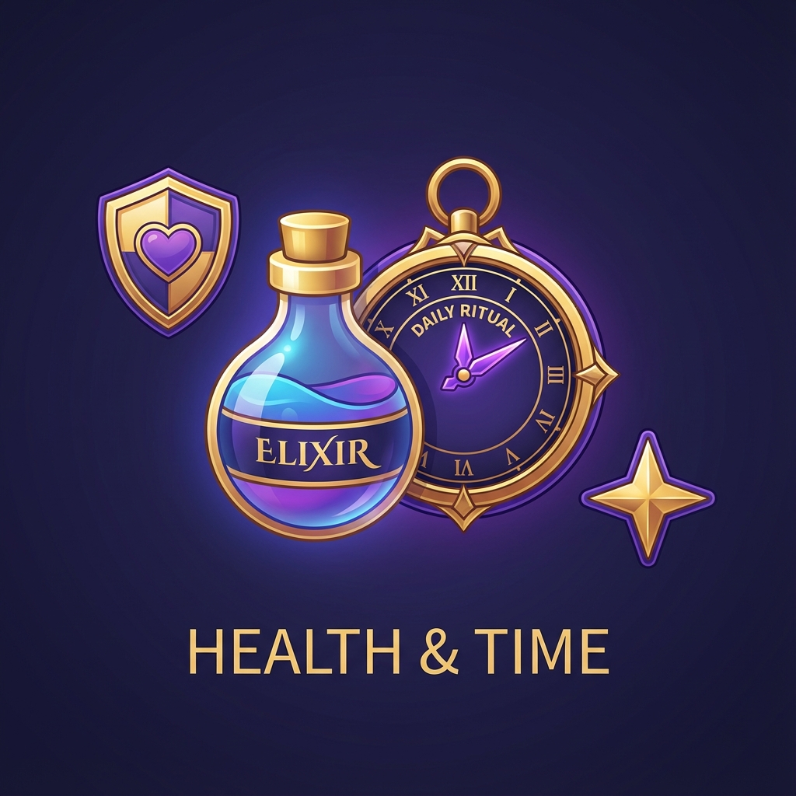

# Elixir: Daily Ritual 🧪✨

**Elixir: Daily Ritual** is a high-end, gamified medication and supplement tracker built with SwiftUI and SwiftData. It transforms mundane daily routines into a rewarding journey through RPG-inspired progression, glassmorphism design, and tactile haptic feedback.

## 🚀 Features

- **Gamified Tracking**: Earn XP for every dose taken. Level up from an *Apprentice* to a *Legend*.
- **Streak System**: Build and maintain streaks to earn massive XP bonuses.
- **Progress Visualization**: Beautifully animated *Progress Orb* to see your daily completion at a glance.
- **Glassmorphism UI**: A modern, sleek aesthetic utilizing Apple's `ultraThinMaterial` and custom gradients.
- **Smart Reminders**: Local notifications to ensure you never miss a ritual (in development).
- **Water Tracking**: Integrated hydration monitoring alongside your medications.

## 🏗️ Architecture

The project follows a **Strict MVVM + Service Layer** architecture combined with **Atomic Design** principles:

- **Core**: Design tokens, custom theming engine, and foundation extensions.
- **Data**: SwiftData models for persistence (`Medication`, `DoseLog`, `UserStats`).
- **Services**: Business logic for data management, gamification, and notifications.
- **UI**: 
  - **Components**: Reusable atomic elements (Cards, Buttons, Visuals).
  - **Screens**: Full-featured views (Dashboard, History, Settings).

## 🎨 Design System

Elixir uses a custom design system called **Daily Ritual Design Tokens**:
- **Colors**: Potion Purple (`#8E44AD`), Healing Green (`#2ECC71`), Mana Blue (`#3498DB`).
- **Typography**: SF Pro Rounded with semantic scaling (`.ritualLargeTitle`, `.ritualBody`, etc.).
- **Spacing**: A disciplined 4pt-based grid.
- **Haptics**: Integrated tactile feedback for all major interactions.

## 🛠️ Technology Stack

- **Framework**: SwiftUI
- **Persistence**: SwiftData (iOS 17+)
- **Architecture**: MVVM-S (Service Layer)
- **Minimum Requirements**: iOS 17.0+, Xcode 15.0+

## 📥 Getting Started

1. Clone the repository.
2. Open `ElixirDemo.xcodeproj` in Xcode 15+.
3. Select an iOS 17+ simulator.
4. Build and Run (`Cmd + R`).

*Note: For development, use `DataController.preview` to seed the app with sample medications and a Level 5 user.*

## 📈 Roadmap

- [ ] **Custom Themes**: Allow users to unlock and select premium color schemes.
- [ ] **History Calendar**: A comprehensive view of past compliance.
- [ ] **Interactive Widgets**: Quick-log doses directly from the Home Screen.
- [ ] **HealthKit Integration**: Sync vitamins and supplements with Apple Health.

## 📄 License

This project is a demonstration of modern iOS development practices and design patterns.

---

*Stay healthy, keep the ritual.*
